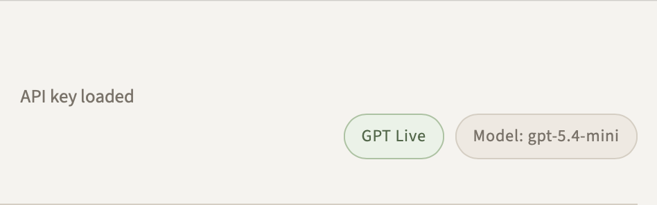

# Retail Data Analytics Chat System

A small interview project that answers retail analytics questions from a transaction dataset through a chat-style interface.

## Repository Deliverables
- Complete project code for local setup and demo
- Streamlit chat UI and FastAPI backend
- Dataset setup instructions
- Environment variable instructions
- Example queries
- Screenshots of the system in action

## What It Supports
- Customer purchase history queries
- Customer total spend queries
- Product average discount queries
- Product store availability queries
- Aggregated business metrics such as total revenue
- A Streamlit chat UI
- A FastAPI backend
- Rule-based intent parsing with optional OpenAI-powered parsing

## Project Structure
```text
genspark_retail_chat/
├── app.py
├── data/
├── design/
├── notes/
├── screenshots/
├── scripts/
├── src/
└── tests/
```

## Dataset Notes
- File used: `data/Retail_Transaction_Dataset.csv`
- The dataset contains `100,000` rows.
- `ProductID` values are `A/B/C/D`, not `P1234`-style IDs from the homework examples.
- There were no empty values in the first inspection pass.

## Dataset Download / Setup
The repository is set up to run from the project root after cloning.

1. Check whether `data/Retail_Transaction_Dataset.csv` is already present.
2. If it is missing, download the Kaggle Retail Transaction Dataset:
   [Retail Transaction Dataset](https://www.kaggle.com/datasets/fahadrehman07/retail-transaction-dataset/data)
3. Place the CSV at `data/Retail_Transaction_Dataset.csv`.

If the file is already in the repo, no extra dataset setup is required.

## Quick Start
```bash
git clone https://github.com/YouknowwhoA/Genspark_retail.git
cd Genspark_retail
python3 -m venv .venv
source .venv/bin/activate
python -m pip install -r requirements.txt
cp .env.example .env
```

## Environment Variables
The app runs in local rule-based mode by default and does not require an API key.

Optional GPT mode in `.env`:
```bash
LLM_PARSER_MODE=openai_optional
OPENAI_API_KEY=your_key_here
OPENAI_MODEL=gpt-5.4-mini
```

Modes:
- `rule_based`: always use the local parser
- `openai_optional`: try OpenAI first, then fall back safely
- `openai_required`: require OpenAI parsing and surface API/parser failure directly

To enable GPT mode in the UI, set `LLM_PARSER_MODE=openai_optional`, add your own `OPENAI_API_KEY`, and restart Streamlit.

## Run The App
Streamlit UI:
```bash
python -m streamlit run app.py
```

FastAPI server:
```bash
python -m uvicorn src.api:app --reload
```

## Run Tests
```bash
python -m pytest -q
```

## Example Queries
- `How much has customer C109318 spent in total?`
- `What has customer 109318 purchased?`
- `customer 888163 discount and store location`
- `What's the average discount for product A?`
- `Which stores sell product B?`
- `What is the total revenue?`

## Architecture Summary
1. The dataset is loaded from CSV and cached in memory.
2. Query functions answer customer, product, and business questions.
3. The parser turns natural language into a structured intent.
4. Field-aware customer queries can request specific values like discount or store location.
5. The UI and API both call the same parser and query layer.
6. If the optional LLM parser is enabled, the system tries that first and falls back when needed.

## Screenshots
Overview screen:


Conversation and result screen:


GPT mode check:



## Notes For Review
- Reviewers do not need to create their own OpenAI key to run the project.
- The default experience works without any API key through the rule-based parser.
- If a reviewer wants to test GPT mode, they can create a local `.env` file with their own key and set `LLM_PARSER_MODE=openai_optional`.
- Optional OpenAI parsing improves natural-language flexibility but is not required to run the project.
- The bug-fix journey and debugging notes are recorded in `notes/bug_journal.md`.
